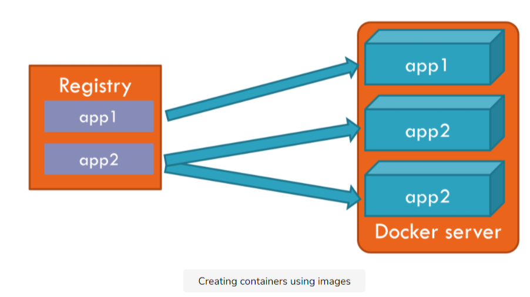
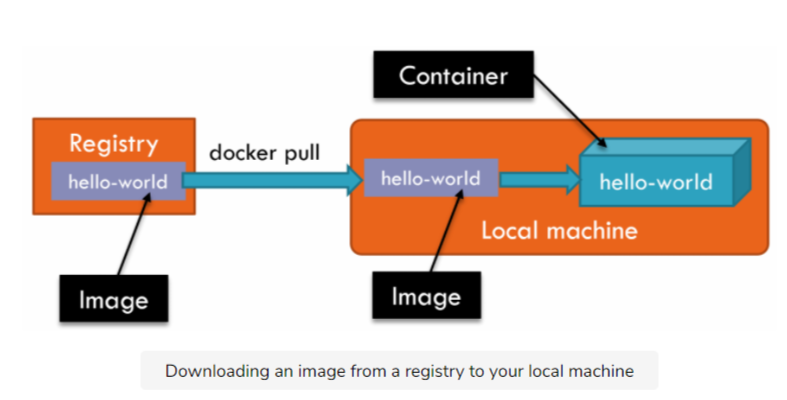
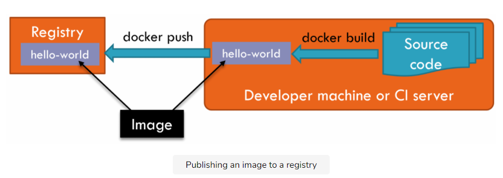
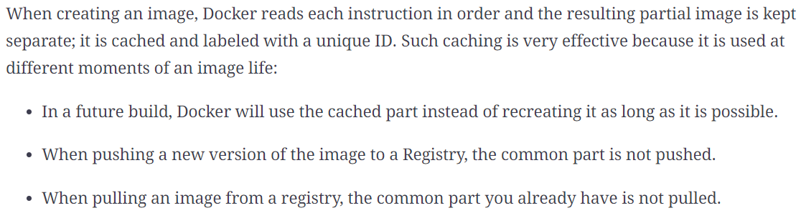

# Docker用法学习

[toc]


### 基本概念

- Container-Images-Registries

  

Registry包含多个Image，一个Image可实例化为一到多个Container，多个Container运行在一台服务器中。

### 使用Docker镜像

#### 容器操作指令

```bash
docker run image_name [command] #实例化镜像并运行指令，如果镜像在本地不存在则联网下载
docker ps [-a] #列出正在运行的镜像，[-a]选项将停止的镜像也列出
docker logs container_name/id #检索容器日志
docker inspect container_name/id #得到容器的详细信息
docker stop container_name/id
docker rm ... 
docker container prune -f #强制删除所有未工作的容器
```

#### 运行服务器式的容器

- [x] 容器最好保持为无状态的，因为这样有助于更好的扩容和恢复：防止数据泄露、不一致

- 一个服务器式的容器，应该满足：
  - 长期运行
  - 监听输入的网络连接的信息

```bash
docker run -d alpine ping www.docker.com #-d选项使得容器在后台长期运行
docker logs [--since 10s] 789b #--since选项，查看最近10s内生成的日志信息
docker run -d -p 8085:80 nginx #-p选项，指定宿主主机和容器内端口的映射关系
```

更多参考

- [Docker容器内部端口映射到外部宿主机端口](https://www.cnblogs.com/kevingrace/p/9453987.html)

#### 使用Volumes

```bash
docker run -v /your/dir:/var/lib/mysql -d mysql:5.7 
```

上述指令将mysql容器在其`/var/lib/mysql`中存储的数据映射到宿主主机的目录`/your/dir/`下持久保存

#### 镜像来自何处？



```
<repository_name>/<name>:<tag>
```

- 当一个镜像被发布到一个注册表时，它的名字格式如上所示：
  - tag可选，不存在时默认是latest
  - repository_name：a registry DNS or the name of a registry in the Docker Hub

- 使用`docker pull`来手动拉取一个镜像到本地

### 创建Docker镜像

#### 创建一个简单的镜像

DockerFile

```
FROM debian:8 #描述引入哪个基本镜像

CMD ["echo", "Hello world"] #运行指令
```

```
FROM nginx:1.15

COPY index.html /usr/share/nginx/html #复制文件到镜像指定目录中
```

编译&&运行

```bash
docker build -t hello . #[-t]选项给创建的镜像指定名字
docker run --rm hello 
```

```bash
docker build -t webserver .
#[--rm]选项：容器停止后立即删除；[-it]选项：使用Ctrl-C从命令行停止容器运行
docker run --rm -it -p 8082:80 webserver
```

更多参考

**[Dockerfile中的COPY与ADD命令](https://www.cnblogs.com/sparkdev/p/9573248.html)**

- 创建镜像
  - 创建一个名为*DockerFile*的文件
  - 运行一个`docker build`指令
- 基于创建的镜像运行一个容器

#### 删除镜像

本地编译生成的镜像存储在`docker build`指令运行时所在文件夹中

```bash
docker image ls #列出本地的所有镜像

docker rmi Image_id/name #删除本地镜像
```

#### 使用环境变量参数

- Providing a value：

  - use the `-e name=value` on the `docker run` command

  - 复用宿主主机的环境变量：use `-e name`

- default value:
  - 在*DockerFile*文件中定义：`ENV name=value`

### 发布Docker镜像

#### 发布一个镜像



- `docker build`编译一个镜像
- `docker login`到一个Registry
- `docker push <dockerID>/<name>:<tag>  ` 将镜像push到Registry

- 使用`docker tag image_name new_name`可以给镜像添加一个新名字

#### 镜像大小

- 镜像中包括的文件
  - *DockerFile*中尽可能精准地使用`COPY`命令
  - 在*build context*中包含一个*.dockerignore*文件
  - 在使用包管理器，例如*NPM, NuGet, apt*等时，在*DockerFile*中使用`RUN`命令，以便在build时就运行包管理器，从而避免将这些包管理器本身传给生成的镜像。运行包管理器的生成结果缓存在Docker的*layer caching system*中。

- 基本镜像的尺寸

  - 在满足应用需求的前提下，尽可能地使用小的基本镜像

- Image Layers

  

  - 为了有效地利用缓存的优点，将*DockerFile*中改动可能性或者其输入改动可能性大的命令，尽可能地放在后面执行。因为某条指令一旦发生了改动，其后面的指令即使没有发生改动，也无法利用缓存。

  - [ ] **感觉有点类似Git的版本管理？**

### Forget SDK Installs

#### Multi-Stage Dockerfiles

```
FROM microsoft/dotnet:2.2-sdk AS builder
WORKDIR /app

COPY *.csproj  .
RUN dotnet restore

COPY . .
RUN dotnet publish --output /out/ --configuration Release

FROM microsoft/dotnet:2.2-aspnetcore-runtime-alpine
WORKDIR /app
COPY --from=builder /out .
EXPOSE 80
ENTRYPOINT ["dotnet", "aspnet-core.dll"]
```

- 使用第一个镜像（大）作为编译工具，对源码进行编译，并将结果存储到该镜像的`/out`目录下
- 使用第二个镜像（小），将第一个镜像`/out`目录下的编译结果复制过来
- 第一个镜像被丢弃，基于第二个镜像生成最终应用镜像

### More about Running Containers

#### Restart Mode

```bash
#以restart模式运行容器，当容器启动或者宿主主机启动时，该容器重启，docker stop命令无效
docker run -d -p 80 --restart always nginx 
#使用docker stop命令可以关闭容器
docker run -d -p 80 --restart unless-stopped nginx
```

### 监控、磁盘空间回收

```bash
docker stats #列出运行的容器占用的资源信息

docker container prune -f #强制删除所有未工作的容器
docker volume prune -f #强制删除volume
docker image prune -f #强制删除无引用的镜像
docker image prune --all #删除所有镜像
```

***ok, finished:smiley_cat:***

