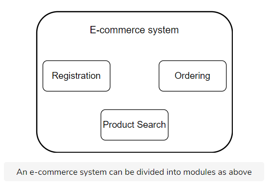
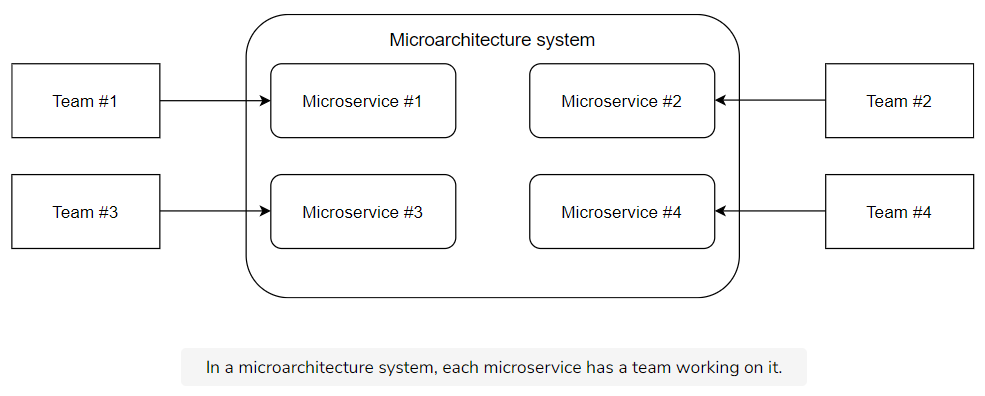
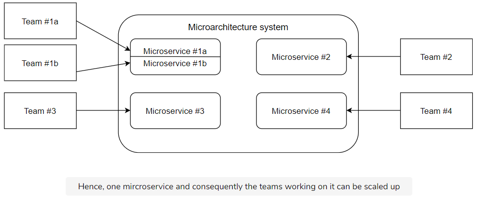
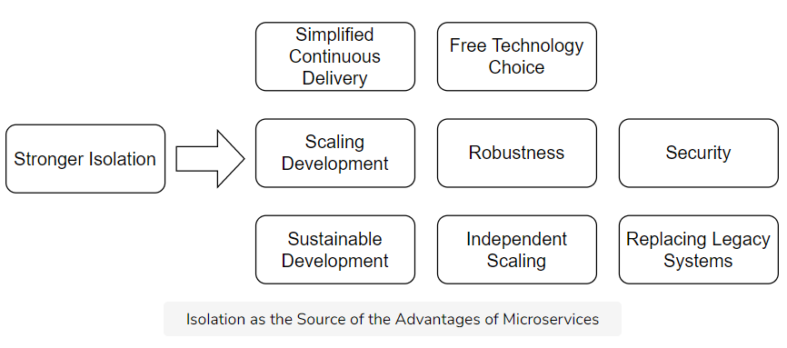

# 微服务学习

[toc]

### 微服务

#### 简介

> **Microservices** are independently deployable modules.

#### 优点

##### scaling development

    
    

##### Sustainable development

- 在经典架构中，开发人员很容易无意识地在模块之间引入新依赖，因为此时开发人员的注意力集中在代码层次，而非架构层次。通常，很难弄清楚一个类属于哪一个模块，因此也很容易搞混在哪个模块中引入了新的依赖。因此，越来越多的依赖随着时间引入到项目中，整个项目的架构变得非结构化、混乱。

- 微服务模块之间有明确的界限（由于其接口设计），因此往微服务模块中引入新的依赖时，是很容易注意到的。微服务模块之间的接口充当了架构防火墙（*architecture firewalls*）的功能，因为它们防止了架构冲突。

#####  facilitate continuous delivery

- 微服务使得持续分发流程更快，因为部署单元更小了，从而部署更快
- 持续分发流程包含许多测试阶段，因为部署单元更小，因此在每个测试阶段部署得更快
- 为微服务建立一个持续分发流程更加容易，因为相比整体单个部署而言，微服务需要的硬件资源更少，依赖的第三方软件也更少
- 微服务在部署时风险也更小
- 但是，在整合测试中运行所有的微服务模块时，需要大量资源。因此，整合测试次数必须尽量降至最少——通过同步/异步方式。

##### 鲁棒性

- 当在一个微服务模块中产生内存泄露时，只有这个模块受影响。
- 当然，必须采取措施补偿崩溃的微服务，这就是**弹性**，比如缓存微服务的运行结果

##### 独立的扩展

- 大多数情况下，扩展整个系统是没必要的，只需按需扩展系统的某几个/一个模块即可
- 微服务模块更加容易扩展，可以新建微服务实例并将负载均衡分配到这些实例上
- 需要扩展的微服务模块必须是无状态的
- 独立的微服务扩展更加细粒度化，消耗的资源也更少

##### 自由的技术选择

- 每个微服务模块可以选择自己的技术实现
- 先在一个微服务模块上试验技术，再应用到其他模块上——风险更小

##### 安全

- 在微服务模块之间添加防火墙
- 加密微服务模块之间的通信

##### 总结：隔离

上述的微服务的优点都可以归因于其强隔离性

#### 缺点

##### 需要更多的操作

- 在微服务系统中，存在许多需要部署和监视的可部署单元
- 只有当操作基本是自动化，并且通过适当的监视来保证微服务功能时，系统才可行

##### 必须是独立可部署的

##### 测试必须是独立的

- 当所有的微服务一起测试时，一个微服务可能会阻塞测试阶段，并阻止其他微服务的部署
- 由于分成了微服务，更多的接口需要测试，而且测试必须对接口两端的微服务模块独立

##### 改变多个微服务时很困难

- 涉及多个微服务的改动比设计单个部署中多个模块的改动更加困难

##### 通信延迟与失败

- 微服务模块间使用网络通信而非本地通信，延迟可能会更高
- 通信也可能失败

