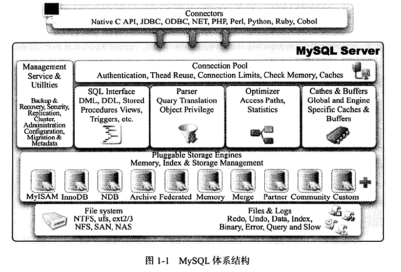
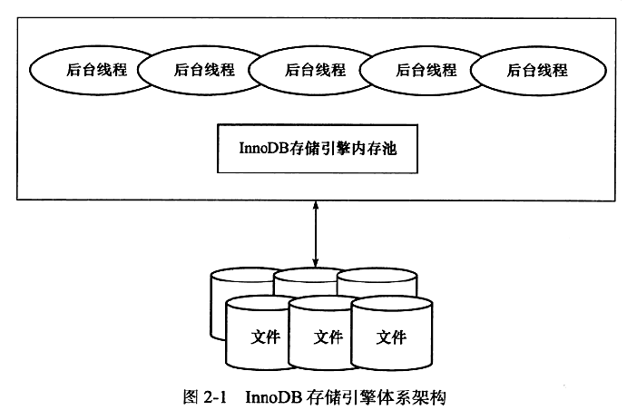
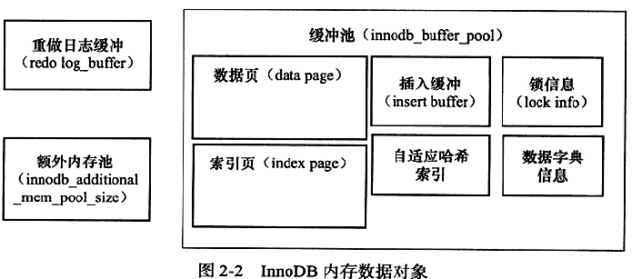
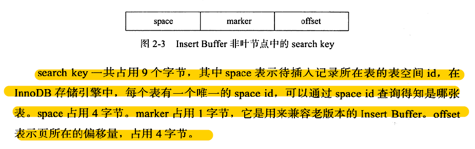
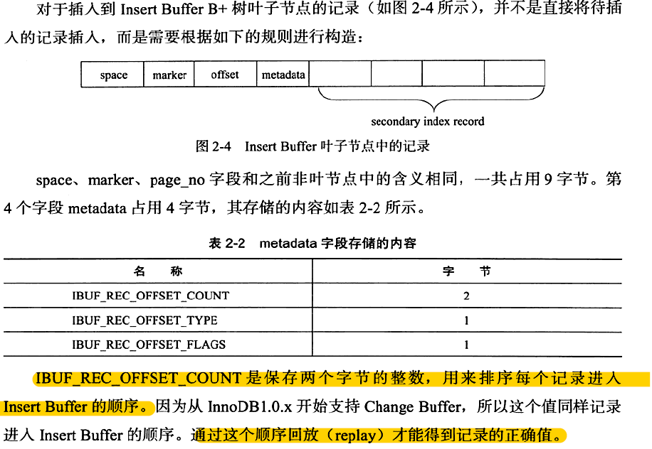
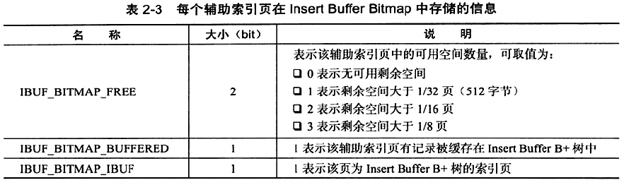
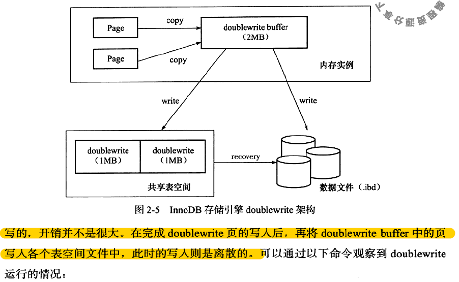

# MySQL学习

[toc]

### 教程

以下为对MySQL5.7官方文档中的**tutorial**章节的重要点的记录：

#### Entering Queries

```bash
mysql> select version(), current_date(), now(); #大小写均可，now()的结果精确到时分秒
# \c，取消命令
```

#### Creating and Using a Database

```bash
#授予指定用户在指定主机上对menagerie数据库中的所有表的所有操作权限
mysql> GRANT ALL ON menagerie.* TO 'your_mysql_name'@'your_client_host';
```

##### Creating and Selecting a Database

```bash
# 在类Unix系统中，数据库名和表名是大小写敏感的，这点不同于关键字；但在Windows系统中，数据库名和表名不是大小写敏感的，但是在用到数据库名或表名时，最好和创建时书写方式保持一致
mysql> CREATE DATABASE menagerie;

# 在未登录时直接登录并使用数据库menagerie
shell> mysql -h host -u user -p menagerie
Enter password: ********
```

##### Loading Data into a Table

```bash
Whistler        Gwen    bird    \N      1997-12-09      \N

# 加载文件pet.txt中的数据到表pet中，pet.txt中的数据格式如上所示，注意NULL用\N表示
mysql> LOAD DATA LOCAL INFILE '/path/pet.txt' INTO TABLE pet;

# 在windows系统中使用以'\r\n'为行结束符的编辑器创建pet.txt时，应该这样加载数据
mysql> LOAD DATA LOCAL INFILE '/path/pet.txt' INTO TABLE pet
       LINES TERMINATED BY '\r\n';
```

##### Date Calculations

```bash
# curdate() = current_date()
mysql> SELECT name, birth, CURDATE(),
       TIMESTAMPDIFF(YEAR,birth,CURDATE()) AS age
       FROM pet;
       
# 查询条件为：月份=当前日期的下一个月的月份
mysql> SELECT name, birth FROM pet
       WHERE MONTH(birth) = MONTH(DATE_ADD(CURDATE(),INTERVAL 1 MONTH));
mysql> SELECT name, birth FROM pet
       WHERE MONTH(birth) = MOD(MONTH(CURDATE()), 12) + 1;
```

##### Working with NULL Values

```bash
# NULL是没有数据，不等于0或者''
mysql> SELECT 0 IS NULL, 0 IS NOT NULL, '' IS NULL, '' IS NOT NULL;
+-----------+---------------+------------+----------------+
| 0 IS NULL | 0 IS NOT NULL | '' IS NULL | '' IS NOT NULL |
+-----------+---------------+------------+----------------+
|         0 |             1 |          0 |              1 |
+-----------+---------------+------------+----------------+
```

##### Pattern Matching

- 方式一：标准SQL模式匹配

```bash
# 匹配以b开头的（不区分大小写），如果是lile binary 'b%'，则区分大小写
mysql> SELECT * FROM pet WHERE name LIKE 'b%'; 
mysql> SELECT * FROM pet WHERE name LIKE '%fy';
mysql> SELECT * FROM pet WHERE name LIKE '%w%';
mysql> SELECT * FROM pet WHERE name LIKE '_____'; #匹配name长度为5的
```

- 方式二：基于扩展正则表达式的模式匹配

这种方式只要模式在字符串/值的任何位置匹配，就算匹配成功；而第一种方式需要模式与字符串/值完全匹配，才算匹配成功。

```bash
# 匹配name以b开头的记录行，不区分大小写
mysql> SELECT * FROM pet WHERE name REGEXP '^b';
# 区分大小写
mysql> SELECT * FROM pet WHERE name REGEXP BINARY '^b';
# 匹配name以fy结尾的记录行，不区分大小写
mysql> SELECT * FROM pet WHERE name REGEXP 'fy$';
# 匹配name中含有w字符的记录行，不区分大小写
mysql> SELECT * FROM pet WHERE name REGEXP 'w';
# 匹配name的长度等于5的记录行
mysql> SELECT * FROM pet WHERE name REGEXP '^.....$';
# 匹配name的长度等于5的记录行
mysql> SELECT * FROM pet WHERE name REGEXP '^.{5}$';
```

##### Counting Rows

当查询结果除了`count(*)`之外，还有其他字段时，必须有一个`group by`从句，`group by`后紧跟查询结果中的其他字段。否则，以下情况会发生：

- 如果`sql mode`设置为`only_full_group_by`，一个错误会发生：

```bash
mysql> SET sql_mode = 'ONLY_FULL_GROUP_BY';
Query OK, 0 rows affected (0.00 sec)

mysql> SELECT owner, COUNT(*) FROM pet;
ERROR 1140 (42000): In aggregated query without GROUP BY, expression
#1 of SELECT list contains nonaggregated column 'menagerie.pet.owner';
this is incompatible with sql_mode=only_full_group_by
```

- 如果`sql mode`没有设置，处理查询命令时，将每一行视作一个独立的组，但是对每一个命名字段选取的值是不确定的，服务器会从所有行中任意选取一行中的值：

```bash
mysql> SET sql_mode = '';
Query OK, 0 rows affected (0.00 sec)

mysql> SELECT owner, COUNT(*) FROM pet;
+--------+----------+
| owner  | COUNT(*) |
+--------+----------+
| Harold |        8 |
+--------+----------+
1 row in set (0.00 sec)
```

#### Using mysql in Batch Mode

[参考这一小节](https://dev.mysql.com/doc/refman/5.7/en/batch-mode.html)

#### Examples of Common Queries

##### Using User-Defined Variables

```bash
mysql> SELECT @min_price:=MIN(price),@max_price:=MAX(price) FROM shop;
mysql> SELECT * FROM shop WHERE price=@min_price OR price=@max_price;
+---------+--------+-------+
| article | dealer | price |
+---------+--------+-------+
|    0003 | D      |  1.25 |
|    0004 | D      | 19.95 |
+---------+--------+-------+
```

##### Using Foreign Keys

在使用MyISAM引擎时，实际不能使用外键，只能使用`references`关键字去描述使用哪个外表中的哪个字段充当外键的功能。

```bash
CREATE TABLE person (
    id SMALLINT UNSIGNED NOT NULL AUTO_INCREMENT,
    name CHAR(60) NOT NULL,
    PRIMARY KEY (id)
);

# 以下使用了references关键字描述表shirt的owner字段‘映射’表person中的id字段，充当外键的功能
CREATE TABLE shirt (
    id SMALLINT UNSIGNED NOT NULL AUTO_INCREMENT,
    style ENUM('t-shirt', 'polo', 'dress') NOT NULL,
    color ENUM('red', 'blue', 'orange', 'white', 'black') NOT NULL,
    owner SMALLINT UNSIGNED NOT NULL REFERENCES person(id),
    PRIMARY KEY (id)
) ENGINE=MyISAM;

# 当以上面这种方式创建表时，references关键字不会出现在show create table或者describe的输出结果中
SHOW CREATE TABLE shirt\G
*************************** 1. row ***************************
Table: shirt
Create Table: CREATE TABLE `shirt` (
`id` smallint(5) unsigned NOT NULL auto_increment,
`style` enum('t-shirt','polo','dress') NOT NULL,
`color` enum('red','blue','orange','white','black') NOT NULL,
`owner` smallint(5) unsigned NOT NULL,
PRIMARY KEY  (`id`)
) ENGINE=MyISAM DEFAULT CHARSET=latin1
```

##### Searching on Two Keys

```bash
# 这个命令会自动优化输出，不会输出重复的行记录
SELECT field1_index, field2_index FROM test_table
WHERE field1_index = '1' OR  field2_index = '1'
```

##### Calculating Visits Per Day 

```bash
CREATE TABLE t1 (year YEAR, month INT UNSIGNED,
             day INT UNSIGNED);
INSERT INTO t1 VALUES(2000,1,1),(2000,1,20),(2000,1,30),(2000,2,2),
            (2000,2,23),(2000,2,23);

# 查询每年每月中访问一个网页的天数（一天访问多次算访问一次），注意这里位函数的使用
SELECT year,month,BIT_COUNT(BIT_OR(1<<day)) AS days FROM t1
       GROUP BY year,month;
+------+-------+------+
| year | month | days |
+------+-------+------+
| 2000 |     1 |    3 |
| 2000 |     2 |    2 |
+------+-------+------+
```

##### Using AUTO_INCREMENT

```bash
CREATE TABLE animals (
     id MEDIUMINT NOT NULL AUTO_INCREMENT,
     name CHAR(30) NOT NULL,
     PRIMARY KEY (id)
);

INSERT INTO animals (name) VALUES
    ('dog'),('cat'),('penguin'),
    ('lax'),('whale'),('ostrich');

SELECT * FROM animals;
+----+---------+
| id | name    |
+----+---------+
|  1 | dog     |
|  2 | cat     |
|  3 | penguin |
|  4 | lax     |
|  5 | whale   |
|  6 | ostrich |
+----+---------+

# 可以指定id的值，那么插入的值就是指定的值而不是应该自动增加的下一个值；可以指定id为NULL，即使id设置为NOT NULL，此时插入的值仍然为自动增加的下一个值；每一次自动增加的下一个值从当前所有值中的最大值加一
INSERT INTO animals (id,name) VALUES(100,'rabbit');
INSERT INTO animals (id,name) VALUES(NULL,'mouse');
SELECT * FROM animals;
+-----+-----------+
| id  | name      |
+-----+-----------+
|   1 | dog       |
|   2 | cat       |
|   3 | penguin   |
|   4 | lax       |
|   5 | whale     |
|   6 | ostrich   |
|   7 | groundhog |
|   8 | squirrel  |
| 100 | rabbit    |
| 101 | mouse     |
+-----+-----------+

# 可以设置不从1开始自动增长，使用create table或者alter table设置起始值
mysql> ALTER TABLE tbl AUTO_INCREMENT = 100;
```

- **MyISAM Notes**

```bash
CREATE TABLE animals (
    grp ENUM('fish','mammal','bird') NOT NULL,
    id MEDIUMINT NOT NULL AUTO_INCREMENT,
    name CHAR(30) NOT NULL,
    PRIMARY KEY (grp,id)
) ENGINE=MyISAM;

INSERT INTO animals (grp,name) VALUES
    ('mammal','dog'),('mammal','cat'),
    ('bird','penguin'),('fish','lax'),('mammal','whale'),
    ('bird','ostrich');

SELECT * FROM animals ORDER BY grp,id;
+--------+----+---------+
| grp    | id | name    |
+--------+----+---------+
| fish   |  1 | lax     |
| mammal |  1 | dog     |
| mammal |  2 | cat     |
| mammal |  3 | whale   |
| bird   |  1 | penguin |
| bird   |  2 | ostrich |
+--------+----+---------+
```

- 在以上例子中，当auto_increment列是多列索引一部分时，自动增长列的值在每一组（组成索引的列字段）中独立设置

- 如果auto_increment列同时是多个索引的一部分，那么MySQL使用在auto_increment列开始的索引（如果有的话）来生成序列值。例如，如果animals表包含了主键索引（grp, id）以及索引（id），MySQL将会忽视主键索引来生成序列值，而是使用索引（id）来生成序列值，这将会是一个全表单序列，而不是每组一个序列。

### 《MySQL技术内幕》学习笔记

#### MySQL体系结构和存储引擎

##### MySQL体系结构

- 数据库是文件的集合；数据库实例是程序，用户用其来管理数据库。
- MySQL组成：
  - 连接池组件
  - 管理服务和工具组件
  - SQL接口组件
  - 查询分析器组件
  - 优化器组件
  - 缓冲(Cache)组件
  - 插件式存储引擎
  - 物理文件



##### 连接MySQL

- 最常用的方式：TCP/IP
- 命名管道和共享内存：Windows平台，本地连接
- UNIX域套接字：Linux和UNIX环境下，客户端和数据库实例在一台服务器上时可以使用

#### InnoDB存储引擎

##### InnoDB体系架构

InnoDB存储引擎有多个内存块，可以认为这些内存块组成了一个大的内存池，负责如下工作：

- 维护所有进程/线程需要访问的多个内部数据结构
- 缓存磁盘上的数据，方便快速地读取，同时在对磁盘文件的数据修改之前在这里缓存
- redo log缓冲



###### 后台线程

- Master Thread
  - 非常核心，复制将缓冲池中的数据异步刷新到磁盘来保证数据的一致性，具体包括：脏页刷新、合并插入缓冲（insert buffer）、undo页的回收
- IO Thread
  - 4个IO Thread：write(4)、read(4)、insert buffer、log
- Purge Thread
  - 回收事务被提交后不再需要的undo log，减轻原master thread的工作
  - 可以设置为多个——加快undo页的回收；**同时由于purge thread需要离散地读取undo页，这样也能更进一步地利用磁盘地随机读取性能**(不是特别理解)

- Page Cleaner Thread
  - 完成脏页的刷新操作，减轻原master thread的工作压力以及对于用户查询线程的阻塞**


###### 内存

1. **缓冲池**

- 页从缓冲池刷新回磁盘的操作并不是在每次页发生更新时触发，而是通过一种称为Checkpoint的机制刷新回磁盘
- 允许有多个缓冲池实例，每个页根据哈希值平均分配到不同缓冲池实例当中——减少内部资源竞争，增加数据库的并发处理能力



2. **LRU List、Free List和Flush List**

- LRU List
  - 缓存池中页的大小默认为16KB，使用修改的LRU算法进行管理。在LRU列表中加入了midpoint位置，**新读取**的页，不插入到LRU列表的首部，而是放入到midpoint位置，默认配置下，该位置在LRU列表长度的5/8处，将midpoint之后的列表称为old列表，之前的称为new列表。
  - 为什么采用优化的LRU算法：索引或数据的扫描操作访问表中许多页甚至全部页，这些页并不是活跃的热点数据，如果放入列表首部，很有可能将热点数据从LRU列表中挤掉。
  - 两个参数：innodb_old_blocks_pct：控制midpoint位置；innodb_old_blocks_time：表示页读取到midpoint位置后需要等待多久才会被加入到LRU列表的热端
  - 页从LRU列表的old部分加入到new部分的操作：page made young；因为innodb_old_blocks_time的设置导致页没有从old部分移动到new部分的操作：page not made young
  - 对于非16KB的页，通过unzip_LRU列表进行管理，需要注意，LRU中列表中的页包含unzip_LRU列表中的页
- Free List
  - 数据库刚启动时，LRU列表是空的，页都存放在Free List中。
  - Buffer pool size = Free buffers + Database pages(LRU列表中页的数量) + 自适应哈希索引、Lock信息、Insert  Buffer等页（不需要LRU算法进行维护）
- Flush List
  - LRU列表中的页被修改后，称为脏页，即缓冲池中的页和磁盘上的页数据不一致
  - 通过checkpoint机制将脏页刷新回磁盘，Flush列表中的页即为脏页列表，脏页既存在LRU列表中，也存在于Flush列表中

3. **重做日志缓冲**

- InnoDB存储引擎首先将重做日志信息放入到这个缓冲区，然后按照一定频率将其刷新到重做日志文件
- 刷新时机：master thread每秒一次刷新、事务提交时刷新、重做日志缓冲剩余空间小于一半时刷新

4. **额外的内存池**

- 在对一些数据结构本身的内存进行分配时，从该池进行内存分配申请，该区域内存不够时，从缓冲池申请
- 哪些数据结构呢，比如：每个缓冲池的帧缓冲以及对应的缓冲控制对象


##### Checkpoint技术

- Write Ahead Log策略：
  - 事务提交时，先写重做日志，再修改页，这样当由于发生宕机而导致缓冲池中的数据丢失，无法刷新脏页到磁盘时，可以通过重做日志来完成数据的恢复。这也是事务ACID中D的要求
- Checkpoint技术解决了以下几个问题：
  - 缩短数据库的恢复时间
  - 缓冲池不够用时，将脏页刷新到磁盘
  - 重做日志不可用时，刷新脏页
- 两种检查点：
  - sharp checkpoint：数据库关闭时将所有脏页刷新回磁盘
  - fuzzy checkpoint：数据库运行时，只刷新一部分脏页回磁盘
- fuzzy checkpoint：
  - master thread checkpoint：对于这种检查点，由master thread差不多以每秒或每十秒的速度从缓冲池的脏页列表中刷新一定比例的页回磁盘，过程异步，不会阻塞用户查询线程
  - flush_lru_list checkpoint：page cleaner线程检查lru列表中是否有足够的空闲页可供使用，如果没有100个可用空闲页，将lru列表尾部的页移除，如果这些页中有脏页，设置检查点进行刷新。不会阻塞用户查询线程
  - async/sync flush checkpoint：在重做日志不可用（快满了）的情况下，由page cleaner线程负责，强制将从脏页列表中选取的一些脏页刷新回磁盘，从而使得重做日志可以重新覆盖使用（这里的过程应该是：由重做日志刷新脏页，由脏页刷新磁盘）。不会阻塞用户查询线程。详见p48
  - dirty page too much checkpoint：脏页数量太多，导致InnoDB引擎强制进行checkpoint，刷新脏页回磁盘。


##### Master Thread工作方式

- Master Thread具有最高的线程优先级别。其内部由多个循环组成：主循环（loop，大多数操作执行处）、后台循环（background loop，数据库空闲或者连接关闭时）、刷新循环（flush loop， 刷新脏页）、暂停循环（suspend loop，挂起状态）。

- 版本差异太大，看看就好（p49-58）


##### InnoDB关键特性

###### 插入缓冲

1. **Insert Buffer**

- 插入聚集索引（主键）一般是顺序的，不需要磁盘的随机读取，因为主键一般设置为自动增长，此时页中的行记录按照主键的值进行顺序存放；但是如果主键类是UUID类型，或者即使主键是自增的，但是插入行记录指定了主键值，那么插入可能和插入辅助索引一样，需要磁盘的随机读取
- 在进行插入操作时，**数据页**的存放是按照主键进行顺序存放的，但是对于非聚集索引（辅助键）叶子节点的插入不再是顺序的，这时需要离散地访问非聚集索引页；但在某些情况下，辅助索引地插入仍然是顺序的，或者是比较顺序的，比如用户购买表中的时间字段
- **为了提高插入辅助索引的效率**：对于非聚集索引的插入或者更新操作，不是每一次直接插入到索引页中，而是先判断插入的非聚集索引页是否存在缓冲池中，若是，则直接插入；否则，先放入到一个**Insert Buffer**对象中，在Insert Buffer中，对于在一个索引页中的多个插入操作通常能合并成一个操作，然后再合并Insert Buffer与辅助索引叶子节点
- Insert Buffer适用对象：不要求唯一的辅助索引

2. **Change Buffer**

- Insert Buffer的升级版，InnoDB存储引擎从这个版本开始可以对DML操作——insert、delete、update都进行缓冲，它们分别是：Insert Buffer、Delete Buffer、Purge Buffer
- 适用对象依然是不要求唯一的辅助索引
- 对一条记录进行update操作分为两个过程：将记录标记为已删除（delete buffer）；真正将记录删除（purge buffer）

3. **Insert Buffer的内部实现**

- Insert Buffer的数据结构是一颗B+树，并且是全局的，负责对所有表的辅助索引进行Insert Buffer，而这颗B+树存放在共享表空间中。

- 其非叶节点的键值构造：

  

- 其叶子节点的键值构造：

  

4. **Merge Insert Buffer**

- 为了保证合并插入缓冲成功，设置了一个Insert Buffer Bitmap页来标记辅助索引页（space，page_no）的可用空间，每个Insert Buffer Bitmap页追踪16384个辅助索引页，每个Insert Buffer Bitmap页在16384个页的第二个页，该页的结构：



- Merge Insert Buffer的时机：见p65-66

###### 两次写（double write）

- 如果发生写失效，比如宕机了，怎么恢复数据？——可以通过重做日志来恢复，但是重做日志中记录的是对页的物理操作，比如在页内偏移量800处，写入"aaa"记录。如果该页本身的结构损坏了，再对齐进行重做是没有意义的，因此在应用重做日志时，需要一个页的副本，当写入失效时，先通过页的副本还原本页，再进行重做。这就是两次写。（感觉不太对。。。）

- 两次写的过程：

  

  

- 如果操作系统在将页写入磁盘的过程中发生了崩溃，在恢复过程中，InnoDB存储引擎可以从共享表中的doublewrite中找到该页的一个副本，将其复制到表空间文件，再应用重做日志（按理说共享表中的double write已经是刷新过的内容，为什么复制到磁盘之后，还需要重新应用重做日志呢？）

###### 自适应哈希索引

- InnoDB存储引擎会监控对表上各索引页的查询，如果观察到建立哈希索引可以带来速度提升，则建立哈希索引，称之为自适应哈希索引（AHI）

- InnoDB引擎自动根据访问的频率和模式来自动地为某些热点页建立哈希索引，其有一个要求，就是对这个页的连续访问模式必须是一样的

###### 异步IO

- 相较于Sync IO的优点：
  - 对于IO密集型操作（表/索引扫描），需要多次对不同页的IO请求，同步IO需要执行完一次IO操作（扫描完一个页），才能继续做下一次IO操作；而异步IO不用
  - AIO可以进行IO Merge操作，即将多个IO合并成一个IO

###### 刷新邻接页

- 刷新脏页时，检查页所在区的其他页，如果是脏页，一起刷新

