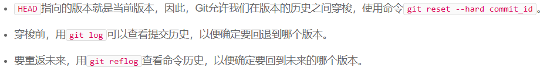
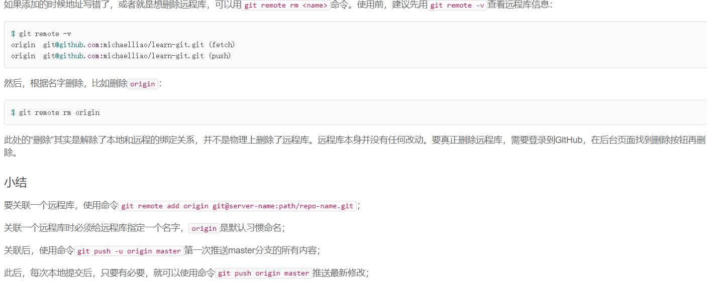
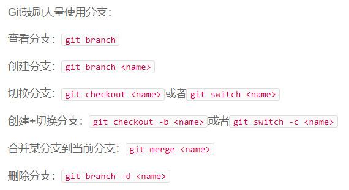

# git用法学习

### 创建版本库，添加、提交文件

#### 创建版本库 

- 创建文件夹，文件夹中执行：

  ```bash
  git init
  ```

#### 添加文件

- 仓库内新建文件（可多个），再执行（一次执行）：

  ```bash
  git add file1 file2 ... filen
  ```

#### 提交文件

- 多次添加，一次提交，执行：

  ```bash
  git commit -m "描述"
  ```

### 版本间穿梭

#### 查看状态

- 查看工作区（当前仓库）的状态;

- 查看文件有无被修改过

  ```bash
  git status
  git diff
  ```

#### 版本回退




#### 工作区与暂存区


#### 撤销修改


#### 删除文件

```bash
git rm file #此为从git版本库里将文件删除，删除后还需要提交
```

### 远程仓库

#### 添加远程仓库



### 分支管理

#### 创建与合并分支

