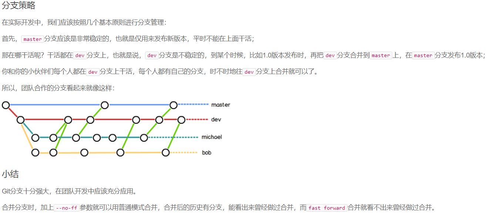
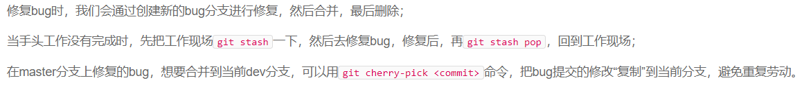
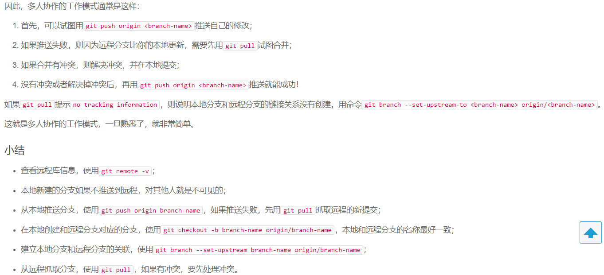
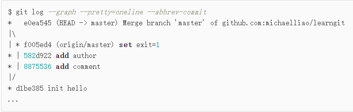

# git用法学习

### 创建版本库，添加、提交文件

#### 创建版本库 

- 创建文件夹，文件夹中执行：

  ```bash
  git init
  ```

#### 添加文件

- 仓库内新建文件（可多个），再执行（一次执行）：

  ```bash
  git add file1 file2 ... filen
  ```

#### 提交文件

- 多次添加，一次提交，执行：

  ```bash
  git commit -m "描述"
  ```

### 版本间穿梭

#### 查看状态

- 查看工作区（当前仓库）的状态;

- 查看文件有无被修改过

  ```bash
  git status
  git diff
  ```

#### 版本回退


#### 工作区与暂存区


#### 撤销修改


#### 删除文件

```bash
git rm file #此为从git版本库里将文件删除，删除后还需要提交
```

### 远程仓库

#### 添加远程仓库


### 分支管理

#### 创建与合并分支


#### 解决冲突


当git无法自动合并分支时，必须首先解决冲突，再提交，合并完成。

解决冲突就是把Git合并失败的文件手动编辑为我们希望的内容，再提交。

用***git log --graph***命令可以看到分支合并图

#### 分支管理策略



#### Bug分支



#### Feature分支

开发一个新feature，最好新建一个分支；

如果要丢弃一个没有被合并的分支，可以通过***git branch -D <name>***来强行删除；

但是如果提前获知待丢弃分支的commit id，强行删除后仍然可以通过***git reset***来移动到该提交。

#### 多人协作



#### Rebase

同步远程最新代码，**git push**产生冲突，说明有人先你一步同步了他的本地代码到远程;

此时使用**git pull**拉取远程的提交并于本地的提交进行合并，并自动提交；

如果**git pull**时有冲突，则需要手动解决并手动提交；

合并之后会产生merge的记录，使用**git log**查看如下所示:



产生了历史分叉，使用**git rebase**可以将原本分叉的提交合并为一条直线，如下图所示；

此时本地的修改不再基于d1be385，而是基于f005ed4，即所谓**变基**。


然后可以**git push**同步本地提交到远程，此时远程的提交历史也会是一条直线。

- rebase操作可以把本地未push的分叉提交历史整理成直线
- rebase的目的是使我们在查看历史提交的变化时更容易，因为分叉的提交需要三方对比